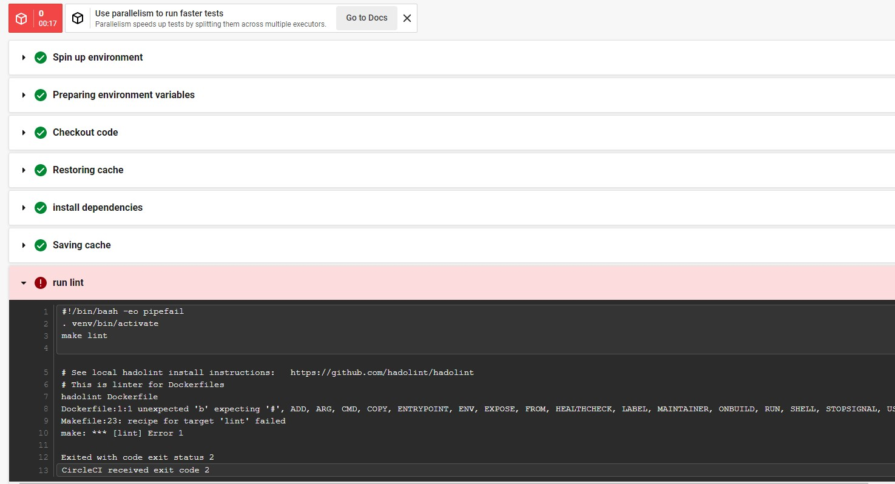
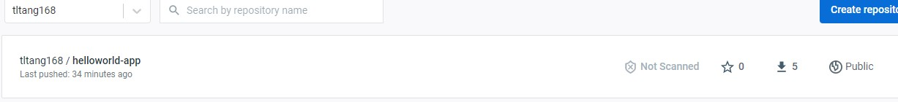

## Project Overview

In this project you will apply the skills and knowledge which were developed throughout the Cloud DevOps Nanodegree program.
You will use cloud9 to develop the project, use circleci to build pipeline, and create docker and kubernetes clusters via circleci pipeline

## Tools used
* AWS CLI
* github
* circleCI
* docker
* kubernetes cli
* AWS EKS and cloudformation

## Set up the Environment

* Clone this repo into your local workspace
In cloud9, git clone git@github.com:tltang/devops_capstone.git
* Create python virtualenv & source it:
make setup 
* Install the necessary dependencies
make install
* Lint Dockerfile and app.py
make lint

## Set up circleCI

* make sure you have the config.yml in .circleci folder
* connect this git repository with circleCI
* add environment variables 
  * AWS_ACCESS_KEY_ID
  * AWS_SECRET_ACCESS_KEY
  * AWS_DEFAULT_REGION
  * DOCKER_USERNAME
  * DOCKER_PASSWORD

* after you connect the repository with circleCI, every checkin will trigger a pipeline run
* Below is the screenshot of a successful make lint run
  
* Then we intentionally cause the lint fail and generate a failed lint run screenshot
  
* when step build-publish runs, it publishes an image to docker.
  
  

## Set up Kubernetes

When circleci step "create-cluster" runs, it 
* install kubectl
* install eksctl
* Create initial AWS EKS cluster using eksctl and config file cluster.yml
  
  
* Create CloudFormation stacks
  
* Create Kubernetes Notes
  
  
* Create AWS ec2 instances
  

## Deploy App

When step deploy-application runs, it deploys the rolling current version to Kubernetes.
* Deployment images are as follows
  
  

* Go to the External IP, we can see our current version Version 1 is running
  
  
Rolling deployment to AWS EKS after update to app.py
---

## Running `app.py`

1. Standalone:  `python app.py`
2. Run in Docker:  `./run_docker.sh`, below is the image showing the docker local run
   
3. Push image to Docker Hub: `./upload_docker.sh`, below is the image showing the docker upload
   
4. 
5. Rolling deployment to AWS EKS after update to app.py:  `./deploy_kubernete.sh`.

---
## Brief file description
* `app.py` - Python flask app
* `Dockerfile` - commands to assemble the docker image
* `run_docker.sh` - build and run docker image locally
* `upload_docker.sh` - upload docker image to docker hub
* `cluster.yml` - simple k8s cluster config
* `run_k8s.sh` - initial k8s deployment
* `deploy_k8s.sh` - rolling k8s deployment
---
